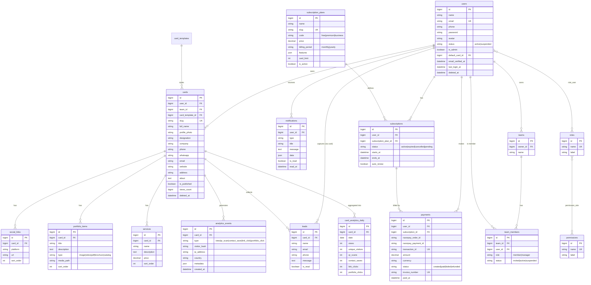

# Entity-Relationship Diagram

Rendered with Mermaid. All tables use `bigint unsigned` primary keys, `timestamps`,
and (where noted) `deleted_at` soft deletes.

## Cardinality summary

- A **user** owns many **cards**, **subscriptions**, **payments**, **notifications**, and one **team** (business plan).
- A **card** has many **social_links**, **portfolio_items**, **services**, **leads**, and **analytics_events**.
- **analytics_events** are rolled up nightly into **card_analytics_daily** for fast reporting.
- **roles ↔ permissions** and **users ↔ roles** are many-to-many (RBAC).
- A **subscription** references one **subscription_plan**; **payments** optionally reference a **subscription**.
